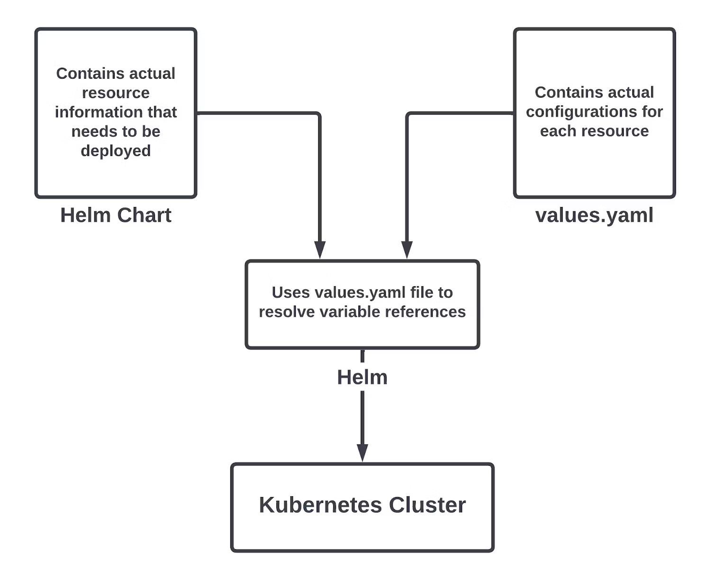
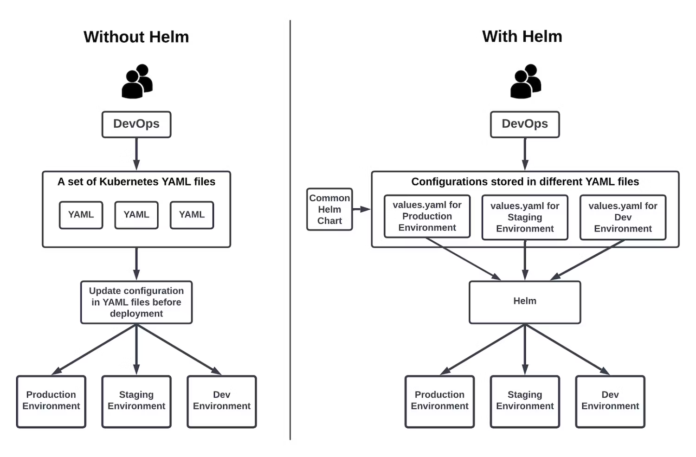

## How Helm works

> **The Helm application library uses charts to define, create, install, and upgrade Kubernetes applications. Helm charts allow you to manage Kubernetes manifests without using the Kubernetes command-line interface (CLI) or remembering complicated Kubernetes commands to control the cluster.**

> **Consider a practical scenario where Helm is helpful. Suppose you want to deploy your application in a production environment with ten replicas. You specify this in the deployment YAML file for the application and run the deployment using the `kubectl` command.**

> **Now, run the same application in a staging environment. Assume that you need three replicas in staging and that you will run an internal application build in the staging environment. To do this, update the replicas count and the Docker `image` tag in the deployment YAML file and then use it in the staging Kubernetes cluster.**

> **As your application becomes more complex, the number of YAML files increases. Eventually, the configurable fields in the YAML file also increase. Soon, updating many YAML files to deploy the same app in different environments becomes hard to manage.**

> **Using Helm, you can parameterize the fields depending on the environment. In the previous example, instead of using a static value for replicas and Docker images, you can take the value for these fields from another file. This file is called `values.yaml`.**

> **Now, you can maintain a values file for each environment with the proper values for each. Helm helps you decouple the configurable field values from the actual YAML configuration.**

