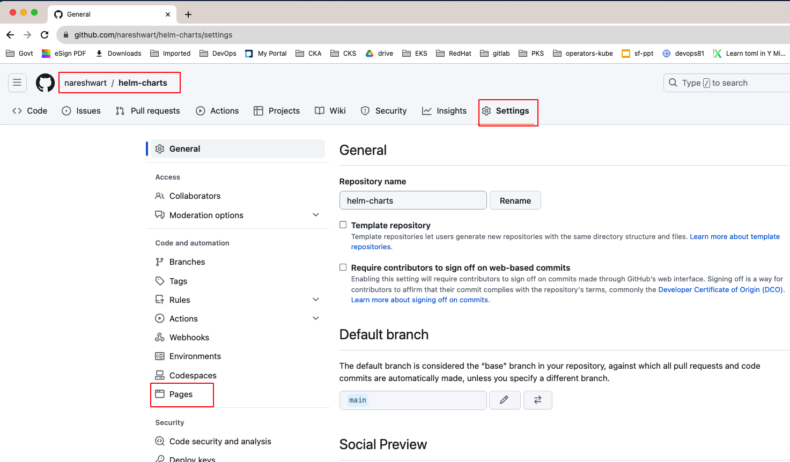
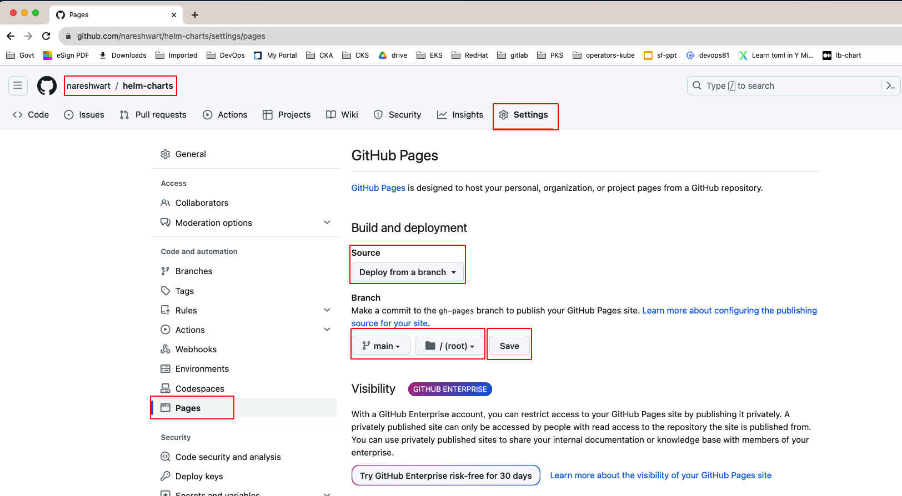
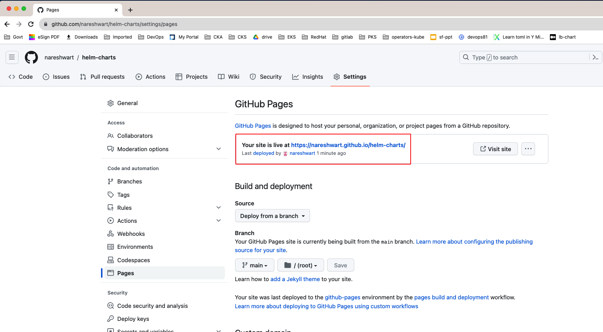

##  Helm Repository on GitHub

### SingUp & Login to GitHub Account
 
> https://github.com/signup

## Create Repository & enable github pages 








### Also access the GitHub pages site
>  https://nareshwart.github.io/helm-charts/

## Clone the GitHub Repository local desktop
```sh
# Clone the GitHub Repository
cd $HOME ; git clone git@github.com:nareshwart/helm-charts.git
```

## develop OR get the charts 
```sh
# Change Directory
cd $HOME/helm-charts

# lets pull charts from other registries
mkdir charts ; cd charts
helm repo add lerndevops https://lerndevops.github.io/helm-charts/
helm repo add bitnami https://charts.bitnami.com/bitnami

helm pull lerndevops/mongodb --untar
helm pull bitnami/tomcat --untar
helm pull bitnami/jenkins --untar
```

## package the charts now 

```sh 
# Change Directory
cd $HOME/helm-charts ; mkdir packages ; cd packages 
helm package $HOME/helm-charts/charts/* 
```

## create a index.yaml in the root of GitHub repo 
```sh 
cd $HOME/helm-charts
## helm repo index --url https://<youracctname>.github.io/<reponame>/
helm repo index --url https://nareshwart.github.io/helm-charts/ .
```

# push the charts & packages to github 
```sh 
cd $HOME/helm-charts 
git add .
git commit -m "packages" 
git push 
<use the appropriate credentials of your github account>
```


## start using the github repo as helm chart repo now 
```sh 
helm repo list  
helm repo add nareshwart https://nareshwart.github.io/helm-charts/
```
## search the helm repo 
```sh
helm repo update 
helm search repo nareshwart
```

## install a chart from repo 
```sh 
helm repo update 
helm install mymongo nareshwart/mongodb
```

## uninstall chart 

```sh 
helm uninstall mymongo
```