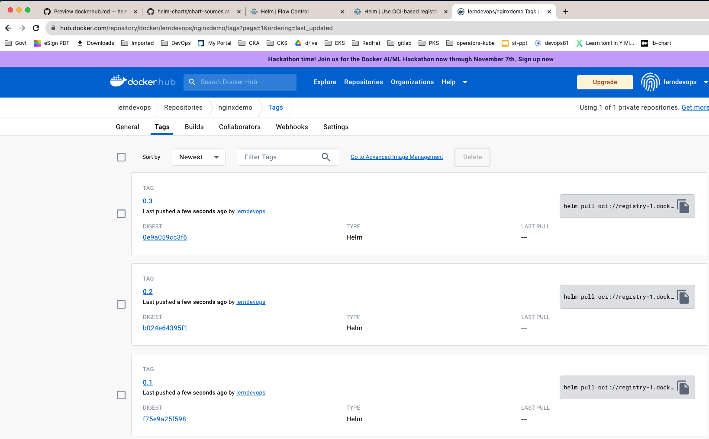

# Use DockerHub as Helm Registry 

## Package a Helm Chart

### lets use the helm charts from [Github Repo](https://github.com/lerndevops/helm-charts/tree/main/chart-sources)
```sh
# clone github repo 
cd $HOME ; git clone https://github.com/lerndevops/helm-charts
```
```sh
# inspect the Helm Charts
ls -l $HOME/helm-charts/chart-sources
```
```sh
# create directory to put all helm chart packages 
mkdir $HOME/helm-packages
```
```sh
# package a single chart 
cd $HOME/helm-packages
helm package $HOME/helm-charts/chart-sources/helloapp/
```
```sh
# package all charts 
cd $HOME/helm-packages
helm package $HOME/helm-charts/chart-sources/*
```
### Note: `helm package will create the tar bundles of all charts provided`

## publish/push charts to OCI Registry: Docker Hub

```t
# SigUp and SignIn to Docker Hub
https://hub.docker.com
```

```sh
helm registry login docker.io 
Username: xxxxxxxxx
Password: xxxxxxxxx
```
> ***OR***
```sh
# command line: docker login
docker login docker.io
Username: xxxxxxxxx
Password: xxxxxxxxx
```

```sh
# Push Helm Chart to Docker Hub
cd $HOME/helm-packages

# helm push <HELM-PACKAGE>  oci://registry-1.docker.io/<DOCKER-NAMESPACE>
helm push nginxdemo-0.4.tgz oci://registry-1.docker.io/lerndevops
```
```sh
## Update and Push Chart Version: 0.5
# Package with Chart Version and App Version 5.0

helm package $HOME/helm-charts/chart-sources/nginxdemo --version 0.5 --app-version 5.0
helm push nginxdemo-0.5.tgz oci://registry-1.docker.io/lerndevops
```
```t
# Verify on Docker Hub
Review Tabs 1. General 2. Tags
```


## Pull Helm Chart from OCI Registry
```sh
cd $HOME/helm-packages
rm -rf * 
```
```sh
# Helm Pull
helm pull oci://registry-1.docker.io/lerndevops/nginxdemo --version 0.1
helm pull oci://registry-1.docker.io/lerndevops/nginxdemo --version 0.2
```
## Helm Template and Show Commands
```sh
# Helm Template Command
helm template <my-release> oci://registry-1.docker.io/lerndevops/nginxdemo --version 0.1.0
helm template mynginx oci://registry-1.docker.io/lerndevops/nginxdemo --version 0.1.0
helm template mynginx oci://registry-1.docker.io/lerndevops/nginxdemo --version 0.2.0
```
```sh
# Helm Show Command
helm show all oci://registry-1.docker.io/lerndevops/nginxdemo --version 0.1.0
helm show all oci://registry-1.docker.io/lerndevops/nginxdemo --version 0.2.0
```

## Helm Install and Upgrade from OCI Registry
```sh
# Helm Install
helm install <my-release> oci://registry-1.docker.io/lerndevops/nginxdemo --version 0.1.0
helm install mynginx oci://registry-1.docker.io/lerndevops/nginxdemo --version 0.1.0
```
```sh
# Helm Status
helm status mynginx --show-resources 
```
```sh
# Helm Upgrade
helm upgrade mynginx oci://registry-1.docker.io/lerndevops/nginxdemo --version 0.2.0
```
